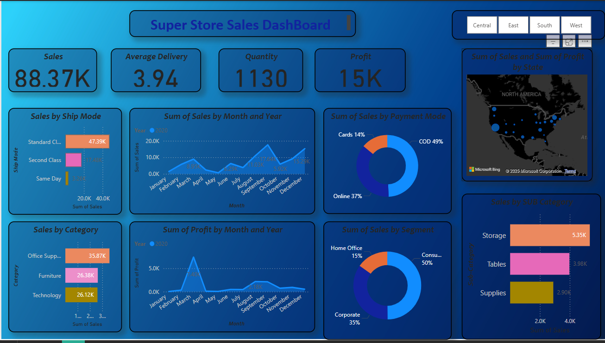

# 🏬 Superstore Sales Analytics Project

This project analyzes sales data from a retail superstore that primarily sells **Furniture**, **Office Supplies**, and **Technology** products. The store receives payments through various methods including **Cash on Delivery (COD)**, **Card Payments**, and **Online Transactions**.

## 📊 Objective

To explore, analyze, and visualize the sales performance across different product categories and payment methods in order to generate actionable business insights.

## 🔍 Key Areas of Analysis

- Sales distribution across product categories and sub-categories
- Revenue trends by payment method (COD, Card, Online)
- Profitability analysis by product and region
- Customer buying behavior across different segments
- Impact of discounts on sales and profit
- Time series trends and seasonal patterns

## 🧰 Tools & Technologies Used

- **SQL** for querying structured data
- **Power BI / Tableau** for data visualization
- **MS Excel** for analysis and documentation
